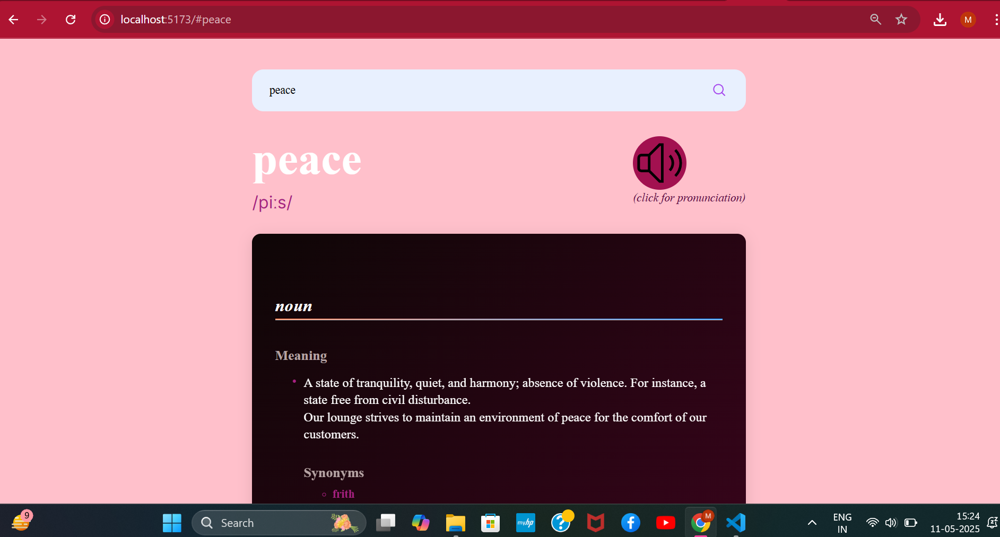
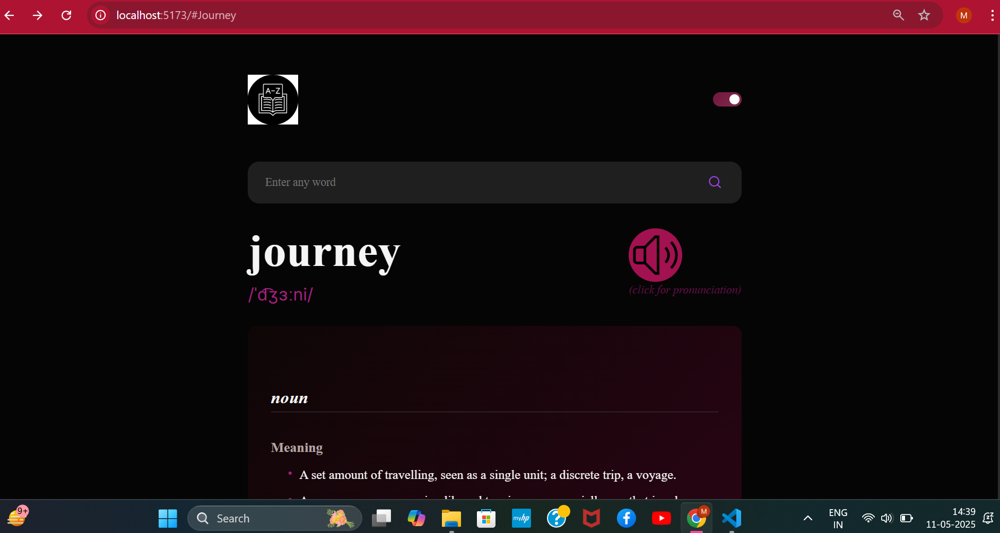
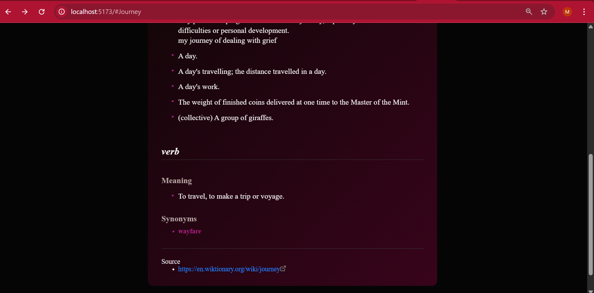

# Frontend Dictionary Web App
A lightning-fast, responsive, and user-friendly dictionary web application powered by Vite, Sass, and JavaScript.
This app allows users to search for word definitions, synonyms, and examples, providing a clean and user-friendly interface. Optimized for fast performance and modern web standards.

## Features:
🔍 Word Search: Find definitions, synonyms, and examples.

💡 Dynamic UI: Smooth animations and a clean, responsive design.

⚡ Fast Performance: Built with Vite for optimized speed.

🎨 Customizable Theme: Styled using Sass for flexible design.

## Tech Stack:
Frontend: HTML, CSS (Sass), JavaScript

Bundler: Vite
